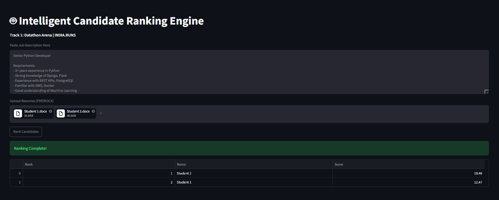

# 🤖 Intelligent Candidate Ranking Engine
**Track 1: Datathon Arena | INDIA.RUNS 2026**

AI-powered tool that automatically ranks resumes based on Job Description using NLP and Semantic Search. Solves the problem of manual resume screening for HR teams.

## 🚀 Demo Video
[Add your YouTube demo link here after recording]

## 📸 Screenshot


## 🛠️ Tech Stack
- **Frontend**: Streamlit
- **AI Model**: sentence-transformers `all-MiniLM-L6-v2` 
- **NLP**: scikit-learn for Cosine Similarity
- **PDF Parsing**: PyPDF2, python-docx

## ⚙️ How It Works
1. HR pastes the Job Description in the text area
2. Uploads multiple candidate resumes (PDF/DOCX format)
3. AI converts JD + all resumes into numerical embeddings
4. Cosine similarity calculates semantic match score for each resume
5. Candidates ranked by relevance score and displayed in a table

## 📦 Local Setup
```bash
pip install -r requirements.txt
streamlit run app.py
